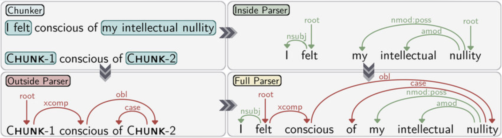

### What is Chunking?

Chunking (shallow parsing) is the process of dividing a sentence into syntactic groups—such as noun phrases (NP), verb phrases (VP), and prepositional phrases (PP)—without building a full parse tree. Chunks are non-overlapping, non-recursive groups of words that form meaningful units, useful for downstream NLP tasks.

### Visualizing Chunking vs. Full Parsing

- **Chunker:** Divides sentences into meaningful groups (chunks), e.g., [NP the current account deficit], [VP will narrow].
- **Full Parser:** Builds a complete syntactic tree, showing all grammatical relationships.

### Why Build a Chunker?

- Simplifies sentence structure for information extraction, question answering, and more
- Faster and more robust than full parsing
- Useful for languages with complex syntax

### Machine Learning Approaches

#### Hidden Markov Model (HMM)

- Probabilistic model predicting the most likely sequence of chunk tags
- Uses transition probabilities and observed word/tag likelihoods
- Effective for tasks with local context dependencies

#### Conditional Random Field (CRF)

- Discriminative model for structured prediction
- Incorporates a wider range of features and dependencies
- Often more accurate for chunking, especially with rich feature sets

### Role of Features and Corpus Size

- **Feature Selection:** Lexicon, POS tags, or both; richer features improve accuracy
- **Training Corpus Size:** Larger corpora provide more examples, generally increasing accuracy

### Summary

In this experiment, you will build chunkers using HMM and CRF, experiment with features and corpus size, and analyze how these choices affect chunking accuracy. The simulation provides hands-on experience with model configuration and performance evaluation.
