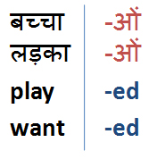
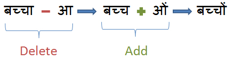

Morphology is the study of the way words are built up from smaller meaning bearing units i.e., morphemes. A morpheme is the smallest meaningful linguistic unit. For eg:

- बच्चों(bachchoM) consists of two morphemes, बच्चा(bachchaa) has the information of the root word noun "बच्चा"(bachchaa) and ओं(oM) has the information of plural and oblique case.
- played has two morphemes play and -ed having information verb "play" and "past tense", so given word is past tense form of verb "play".

Words can be analysed morphologically if we know all variants of a given root word. We can use an 'Add-Delete' table for this analysis.

