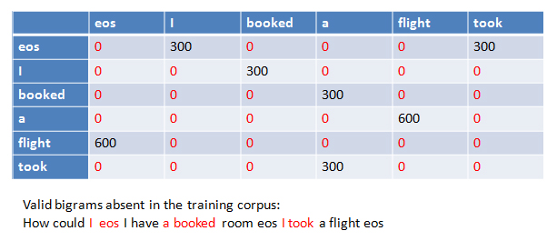

One major problem with standard N-gram models is that they must be trained from some corpus, and because any particular training corpus is finite, some perfectly acceptable N-grams are bound to be missing from it. We can see that bigram matrix for any given training corpus is sparse. There are large number of cases with zero probabilty bigrams and that should really have some non-zero probability. This method tend to underestimate the probability of strings that happen not to have occurred nearby in their training corpus.

There are some techniques that can be used for assigning a non-zero probabilty to these 'zero probability bigrams'. This task of reevaluating some of the zero-probability and low-probabilty N-grams, and assigning them non-zero values, is called smoothing.

