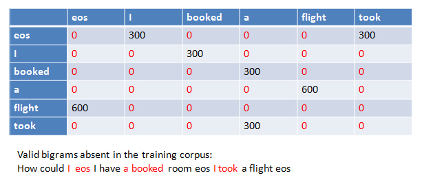

N-gram language models are fundamental tools in Natural Language Processing (NLP) for estimating the probability of word sequences. However, real-world language data is often sparse, leading to zero probabilities for unseen N-grams. Smoothing techniques are used to address this issue by redistributing probability mass to unseen events, ensuring that every possible N-gram has a non-zero probability.

---

### 1. N-Gram Models

An **N-gram** is a contiguous sequence of N items (typically words) from a given text or speech. N-gram models are widely used in Natural Language Processing to estimate the probability of word sequences.

For example:

- **Unigram:** N = 1 (single word)
- **Bigram:** N = 2 (pair of words)
- **Trigram:** N = 3 (three-word sequence)

The probability of a sentence using a bigram model (N=2) is calculated as:

$$
P(w_1, w_2, ..., w_n) = P(w_1) \prod_{i=2}^{n} P(w_i \mid w_{i-1})
$$

Here, \( P(w*i \mid w*{i-1}) \) is the probability of word \( w*i \) given the previous word \( w*{i-1} \).

---

### 2. The Need for Smoothing

In practice, many valid N-grams may not appear in the training corpus, resulting in zero probabilities. This is problematic for language modeling tasks, as it can make the probability of entire sentences zero. Smoothing techniques adjust the estimated probabilities to account for unseen N-grams.

_Example: Many valid bigrams (in red) are absent in the training corpus, leading to zero probabilities._

---

### 3. Add-One (Laplace) Smoothing

One of the simplest smoothing techniques is Add-One (Laplace) Smoothing. It works by adding one to each count before normalizing into probabilities:

$$
P_{Laplace}(w_i | w_{i-1}) = \frac{C(w_{i-1}, w_i) + 1}{C(w_{i-1}) + V}
$$

where \( C(w*{i-1}, w_i) \) is the count of the bigram, \( C(w*{i-1}) \) is the count of the previous word, and \( V \) is the vocabulary size.

---

### 4. Applications

Smoothing is essential in applications such as speech recognition, machine translation, and spelling correction, where robust probability estimates are required even for rare or unseen word sequences.

---

### 5. Summary

- N-gram models estimate the probability of word sequences.
- Smoothing techniques like Add-One Smoothing prevent zero probabilities for unseen N-grams.
- Smoothing improves the robustness and generalization of language models.
