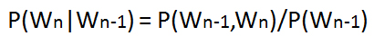

**To understand and practice the computation and application of N-Gram models for natural language, focusing on bigram and trigram probability calculations.**

This experiment aims to help students develop proficiency in building and analyzing N-Gram models (such as bigrams and trigrams) for language data. Through hands-on interaction, students will learn how to compute N-Gram probabilities, apply the Markov assumption, and use these models to estimate the likelihood of word sequences in sentences. The experiment emphasizes both the theoretical foundation and practical computation of N-Gram probabilities in natural language processing.

Here, Wn refers to the word token corresponding to the nth word in a sequence.
