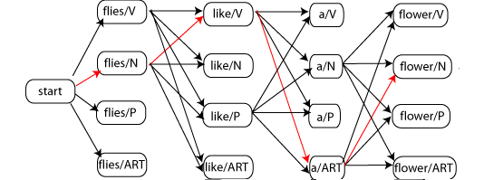

In previous experiment you have calculated the transition and emission matrix, and now in this experiment it will be used to find the POS tag sequence for a given sentence. When we have emission and transition matrix, various algorithms can be applied to find out the POS tags for words. Some of possible algorithms are: Backward algorithm, forward algorithm and viterbi algorithm. Here, in this experiment, you can get familiar with Viterbi Decoding

